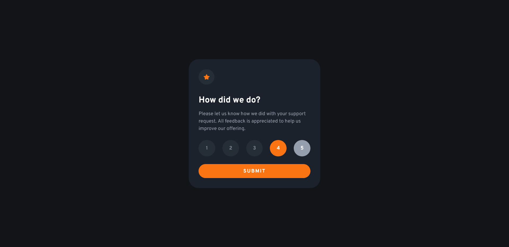
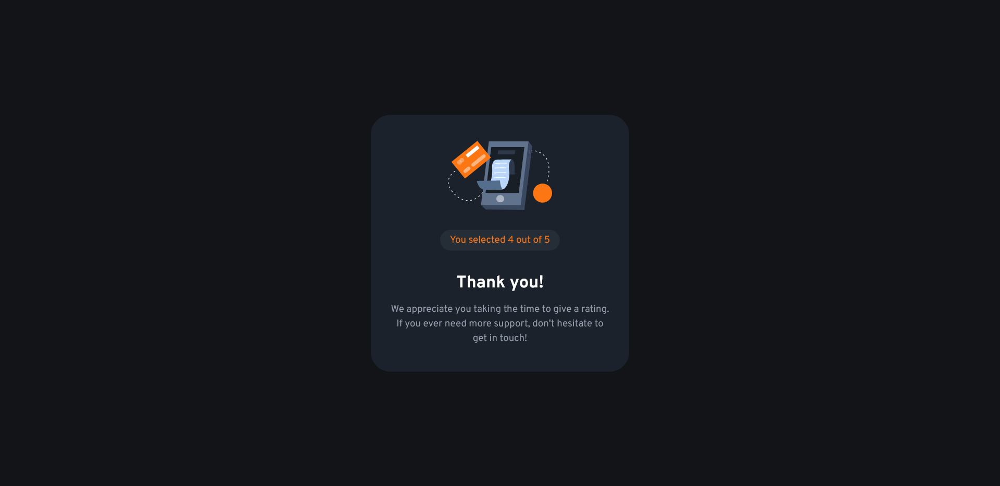
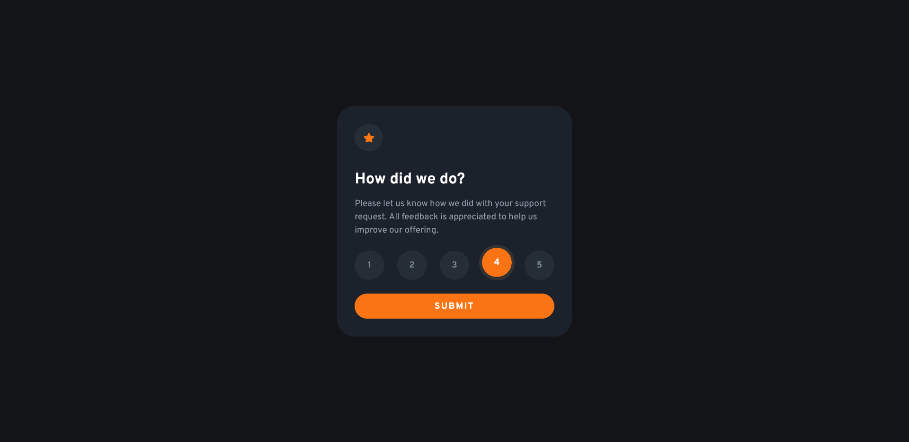

# Frontend Mentor - Interactive rating component solution

This is a solution to the [Interactive rating component challenge on Frontend Mentor](https://www.frontendmentor.io/challenges/interactive-rating-component-koxpeBUmI). Frontend Mentor challenges help you improve your coding skills by building realistic projects.

## Table of contents

-   [Overview](#overview)
    -   [The challenge](#the-challenge)
    -   [Screenshot](#screenshot)
    -   [Links](#links)
-   [My process](#my-process)
    -   [Built with](#built-with)
    -   [What I learned](#what-i-learned)
    -   [Continued development](#continued-development)

## Overview

### The challenge

Users should be able to:

-   View the optimal layout for the app depending on their device's screen size
-   See hover states for all interactive elements on the page
-   Select and submit a number rating
-   See the "Thank you" card state after submitting a rating

### Screenshot





### Links

-   Live Site URL: [Here](https://poetic-crisp-cddcd8.netlify.app/)

## My process

### Built with

-   Semantic HTML5 markup
-   CSS custom properties
-   Flexbox
-   CSS Grid

### What I learned

This project taught me a lot and I'm really proud of finishing it.

#### Some of the things I learnt include:

1. Using the not pseudo class to prevent pressed buttons from being highlighted when hovered over.
   The following properties will only apply if the .pressed utility class was not present on the element.

```css
.rating-item:hover:not(.pressed),
.rating-item:focus-visible:not(.pressed) {
    background-color: var(--light-grey);
    color: white;
    outline: none;
}
```

2. Using the tabindex attribute and ARIA button role to make the component accessible.

```html
<li class="rating-item" tabindex="5" role="button"><span>5</span></li>
```

3. Using utility classes to manipulate elements using JavaScript is much easier and faster than using the style property.

```css
.pressed {
    background-color: var(--orange);
    color: white;
}
.hidden {
    display: none;
    transition: all 0.3s;
}
```

4. Using JavaScript to add the .pressed utility class on buttons.

```js
ratingItems.forEach((el) =>
    el.addEventListener(`click`, function () {
        ratingItems.forEach((el) => el.classList.remove(`pressed`));
        el.classList.add(`pressed`);
    })
);
```

### Continued development

Learning more about accessibility support in HTML is a goal of mine. Understanding and using ARIA labels and other techniques to make the internet more accessible for everyone.

And learning more regrading how to structure JavaScript code. I've declared some variables in the global scope which I don't think is a good practice.
